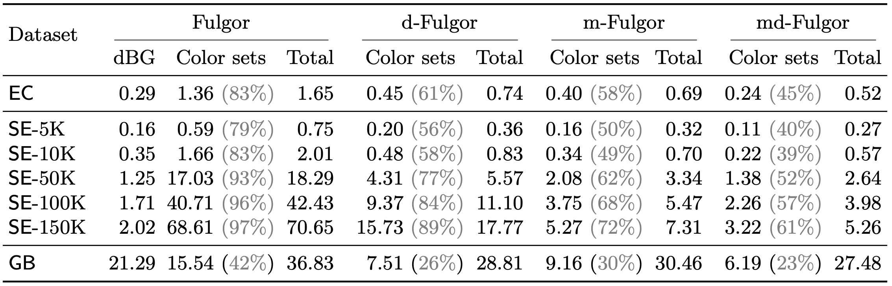

[](https://github.com/jermp/fulgor/actions/workflows/build.yml)
[](https://github.com/jermp/fulgor/actions/workflows/codeql.yml)
[&color=rgb(68,190,80))](http://bioconda.github.io/recipes/fulgor/README.html)

<picture>
  <source media="(prefers-color-scheme: dark)" srcset="img/fulgor_on_dark.png">
  
</picture>

**Fulgor** is a *colored de Bruijn graph* index for large-scale matching and color queries, powered by [SSHash](https://github.com/jermp/sshash) and [GGCAT](https://github.com/algbio/GGCAT).

The Fulgor index is described in the following papers.

- [**Fulgor: A Fast and Compact k-mer Index for Large-Scale Matching and Color Queries**](https://almob.biomedcentral.com/articles/10.1186/s13015-024-00251-9) (Algorithms for Molecular Biology, ALMOB 2024), and
- [**Meta-colored compacted de Bruijn graphs**](https://link.springer.com/chapter/10.1007/978-1-0716-3989-4_9) (International Conference on Research in Computational Molecular Biology, RECOMB 2024).
- [**Where the patterns are: repetition-aware compression for colored de Bruijn graphs**](https://www.liebertpub.com/doi/10.1089/cmb.2024.0714) (Journal of Computational Biology, JCB 2024).
- [**Fast pseudoalignment queries on compressed
colored de Bruijn graphs**](https://doi.org/10.4230/LIPIcs.WABI.2025.6) (International Conference on Algorithms for Bioinformatics, WABI 2025).

Please, cite these papers if you use Fulgor.

### Table of contents
* [Dependencies](#dependencies)
* [Compiling the code](#compiling-the-code)
* [Tools and usage](#tools-and-usage)
* [Quick start](#quick-start)
* [Indexing an example Salmonella Enterica pangenome](#indexing-an-example-salmonella-enterica-pangenome)
* [Pseudoalignment output format](#pseudoalignment-output-format)
* [Kmer conservation output format](#kmer-conservation-output-format)
* [Kmer matches output format](#kmer-matches-output-format)
* [Dump output format](#dump-output-format)

Dependencies
------------

#### GGCAT

The code uses the [GGCAT](https://github.com/algbio/GGCAT) Rust library,
so make sure you have Rust installed. If not, Rust can be installed as recommended [here](https://www.rust-lang.org/tools/install), with

	curl --proto '=https' --tlsv1.2 -sSf https://sh.rustup.rs | sh

#### zlib

If you do not have `zlib` installed, you can do

    sudo apt-get install zlib1g

if you are on Linux/Ubuntu, or

    brew install zlib

if you are using MacOS.


Compiling the code
------------------

The code is tested on Linux with `gcc` and on MacOS with `clang`.
To build the code, [`CMake`](https://cmake.org/) is required.

First clone the repository with

    git clone https://github.com/jermp/fulgor.git

and then do

    git submodule update --init --recursive

to pull all necessary submodules before compilation.

To compile the code for a release environment (see file `CMakeLists.txt` for the used compilation flags), it is sufficient to do the following, within the parent `fulgor` directory:

    mkdir build
    cd build
    cmake ..
    make -j

For a testing environment, use the following instead:

    mkdir debug_build
    cd debug_build
    cmake .. -D CMAKE_BUILD_TYPE=Debug -D FULGOR_USE_SANITIZERS=On
    make -j


Tools and usage
---------------

There is one executable called `fulgor` after the compilation, which can be used to run a tool.
Run `./fulgor help` to see a list of available tools.

	== Fulgor: a colored de Bruijn graph index ===============================================

	Usage: ./fulgor <tool> ...

	Construction:
	  build              build an index
	  color              build a meta- or a diff- or a meta-diff- index
	  permute            permute the reference names of an index

	Queries:
	  pseudoalign        perform pseudoalignment to an index
	  kmer-conservation  print color set info for each positive kmer in query
	  kmer-matches       print positive kmers per query and number of kmer matches per color

	Debug:
	  check              perform an in-depth check to verify that an index was built correctly
	  verify             verify that index works correctly with current library version
	  stats              print index statistics
	  print-filenames    print all reference filenames
	  dump               write unitigs and color sets of an index in text format

	Other:
	  help               print this helper and exit gracefully

For large-scale indexing, it could be necessary to increase the number of file descriptors that can be opened simultaneously:

	ulimit -n 2048


Quick start
-----------

This short demo shows how to index the 10-genome collection
in the folder `test_data/salmonella_10` with Fulgor.
We will use the standard value k = 31.

First create a list of filenames (with absolute paths) for the files in `test_data/salmonella_10`.
From `fulgor/test_data`, do

	find $(pwd)/salmonella_10/* > salmonella_10_filenames.txt

Then, from `fulgor/build`, run

	./fulgor build -l ../test_data/salmonella_10_filenames.txt -o ../test_data/salmonella_10 -k 31 -m 19 -d tmp_dir -g 1 -t 1 --verbose --check

to build an index that will be serialized to the file `test_data/salmonella_10.fur`.


Indexing an example Salmonella Enterica pangenome
-------------------------------------------------

In this example, we will build a Fulgor index, with k = 31, for the 4,546 Salmonella genomes that can be downloaded from [here](https://zenodo.org/record/1323684)
with (assuming you have `wget` installed)

	wget https://zenodo.org/records/1323684/files/Salmonella_enterica.zip
	unzip Salmonella_enterica.zip

We assume all commands are issue from within the home (`~/`) directory.

After download, create a list of all `.fasta` filenames with

	find $(pwd)/Salmonella_enterica/Genomes/*.fasta > salmonella_4546_filenames.txt

and, from `fulgor/build`, run

	./fulgor build -l ~/salmonella_4546_filenames.txt -o ~/Salmonella_enterica/salmonella_4546 -k 31 -m 20 -d tmp_dir -g 8 -t 8 --verbose --check

which will create an index named `~/Salmonella_enterica/salmonella_4546.fur` of 0.266 GB.

We can now pseudoalign the reads from SRR801268, as follows.

First, download the reads in `~/` with

	cd
	wget ftp://ftp.sra.ebi.ac.uk/vol1/fastq/SRR801/SRR801268/SRR801268_1.fastq.gz

and then process them with

	./fulgor pseudoalign -i ~/Salmonella_enterica/salmonella_4546.fur -q ~/SRR801268_1.fastq.gz -t 8 --verbose -o /dev/null

	mapped 6584304 reads
	elapsed = 130133 millisec / 130.133 sec / 2.16888 min / 19.7641 musec/read
	num_mapped_reads 5796427/6584304 (88.034%)

using 8 parallel threads and writing the mapping output to `/dev/null`.

To partition the index to obtain a meta-colored Fulgor index, then do:

	./fulgor color -i ~/Salmonella_enterica/salmonella_4546.fur -d tmp_dir --meta --check

We can change the option `--meta` to `--diff` to create a differential-colored index, or use
both options, `--meta --diff`, to create a meta-differential-colored index.
See the table below.

| command               | output file             | size (GB) | compression factor |
|:----------------------|:------------------------|:---------:|:------------------:|
| `color --meta`        | `salmonella_4546.mfur`  | 0.11769   | 2.26               |
| `color --diff`        | `salmonella_4546.dfur`  | 0.11076   | 2.40               |
| `color --meta --diff` | `salmonella_4546.mdfur` | 0.09389   | 2.84               |


The following table is taken from the paper *"Where the patters are: repetition-aware compression for colored de Bruijn graphs"* and shows the size of the various Fulgor indexes on several larger pangenomes.




Pseudoalignment output format
-----------------------------

The tool `pseudoalign` writes the result to an output file, in plain text format, specified with the option `-o [output-filename]`.

This file has one line for each mapped read, formatted as follows:

	[read-id][TAB][list-lenght][TAB][list]

where `[list]` is a TAB-separated list of increasing integers, of length `[list-length]`, representing the list of reference identifiers to which the read is mapped. (`[TAB]` is the character `\t`.)

#### Example

	1	1	0
	2	1	0
	3	3	0	3	7
	4	1	0
	5	2	0	8
	6	1	0
	7	1	0

**Note**: Read ids might not be consecutive in the output file if multiple threads are used to perform the queries.

#### Important note

If pseudoalignment is performed against a **meta-colored**
or a **differential-meta-colored** Fulgor index,
the reference identifiers in the pseudoalignment output might **not** correspond to the ones assigned following the input-file order as specified with option `-l` during index construction.
This is because the meta-colored index re-assignes identifiers to references to improve index compression.

In this case, the reference identifiers in the pseudoalignment output
are consistent with the ones returned by the `print-filenames` tool.


Kmer conservation output format
-------------------------------

The tool `kmer-conservation` writes the result to an output file, in plain text format, specified with the option `-o [output-filename]`.

This file has one line for each processed read, formatted as follows:

	[read-name][TAB][list-lenght][TAB][list]

where `[list]` is a TAB-separated list of integer triples, of length `[list-length]`.
(`[TAB]` is the character `\t`.)
If a triple is `(p n i)`, it means that the `n` kmers starting at position `p` in the query all have color set id `i`.

Obtaining an iterator over the actual color set of id `i`, is as simple as

```cpp
auto it = index.color_set(i);
```

where the variable `it` is the iterator and `it.size()` is the size of the color set.

#### Example

	SRR801268.985	2	(0 16 1)	(16 7 3)
	SRR801268.986	3	(0 12 1)	(12 6 3)	(18 5 1)
	SRR801268.987	1	(0 23 1)
	SRR801268.988	1	(0 8 3)

For example, in the second query, the triple `(12 6 3)` indicates that the 6 kmers starting at position 12 in the query all have color set id 3.


Kmer matches output format
--------------------------

The tool `kmer-matches` writes the result to an output file, in plain text format, specified with the option `-o [output-filename]`.

This file begins with the line

	num_colors=[N]

where `[N]` is the number of colors in the index and then has one line for each processed read, formatted as follows:

	[read-name][TAB][num-kmers-in-read][TAB][matching-bitvector][matches-per-color]

where

- `[num-kmers-in-read]` is an integer,
- `[matching-bitvector]` is a TAB-separated list of `0/1` digits, of length `[num-kmers-in-read]`: digit `i` is `1` is the `i`-th kmer of the read is present in the index, and `0` otherwise,
- `[matches-per-color]` is a TAB-separated list of integers, of length [N]: the `i`-th integer is `x` if `x` kmers of the read are found in color `i`.

(`[TAB]` is the character `\t`.)

#### Example

	num_colors=10
	(...)
	SRR801268.6	23	1	1	1	1	1	1	1	1	1	1	1	1	1	1	1	1	1	1	1	1	1	1	1	23	23	23	23	23	23	23	23	23	23
	SRR801268.7	23	1	1	1	1	1	1	1	1	1	1	1	1	1	1	1	1	1	1	1	1	1	1	1	23	12	12	23	12	12	12	23	23	12
	SRR801268.8	23	1	1	1	1	1	1	1	1	1	1	1	1	1	1	1	1	1	1	1	1	1	1	1	23	0	0	23	0	0	0	0	0	0
	SRR801268.9	23	1	1	1	1	1	1	1	1	1	1	1	1	1	1	1	1	1	1	1	1	1	1	1	14	0	0	14	0	0	0	14	14	0
	(...)

Dump output format
------------------

The tool `dump` writes in plain textual format the content of an index.
In particular, it outputs four files:

- `[basename].metadata.txt`
- `[basename].filenames.txt`
- `[basename].unitigs.fa`
- `[basename].color_sets.txt`

where `[basename]` is a chosen output name.

The file `[basename].metadata.txt` contains the following basic statistics (one per line and in the following order): the value of k, the number of distinct kmers, the number of colors, the number of unitigs, and the number of color sets, using a simple `key=value` format.

Example:

	k=31
	num_kmers=43788757
	num_colors=4546
	num_unitigs=1884865
	num_color_sets=972178

**Important note**: The values of `num_unitigs` and `num_color_sets` could (slightly) change if the index is re-built because GGCAT does not compute *maximal* unitigs.

The file `[basename].filenames.txt` lists all filenames **in order of color id**.
The file has one line per filename.

Example:

	/Users/giulio/Salmonella_enterica/Genomes/SAL_AA7051AA.fasta
	/Users/giulio/Salmonella_enterica/Genomes/SAL_AA7053AA.fasta
	/Users/giulio/Salmonella_enterica/Genomes/SAL_AA7059AA.fasta
	/Users/giulio/Salmonella_enterica/Genomes/SAL_AA7089AA.fasta
	/Users/giulio/Salmonella_enterica/Genomes/SAL_AA7092AA.fasta
	/Users/giulio/Salmonella_enterica/Genomes/SAL_AA7122AA.fasta
	/Users/giulio/Salmonella_enterica/Genomes/SAL_AA7144AA.fasta
	/Users/giulio/Salmonella_enterica/Genomes/SAL_AA7173AA.fasta
	/Users/giulio/Salmonella_enterica/Genomes/SAL_AA7174AA.fasta
	/Users/giulio/Salmonella_enterica/Genomes/SAL_AA7190AA.fasta
	/Users/giulio/Salmonella_enterica/Genomes/SAL_AA7196AA.fasta
	(...)

This means that color 0 corresponds to the file `.../SAL_AA7051AA.fasta`, color 1 to the file `../SAL_AA7053AA.fasta`, etc.

The file `[basename].unitigs.fa` contains the unitig sequences written in FASTA format.
Each sequence has a header containing the id of the unitig (an increasing integer id) and the id of the corresponding color set.

Example:

	(...)
	> unitig_id=13 color_set_id=0
	TGGTTCTGGCGTGCTCCAGCTCATCCAGCATTGCCAGCACA
	> unitig_id=14 color_set_id=0
	CGATAAGGAATGGCTTGAAAAGCCAACAGAACAACGTCATCTCTCAGATCTGCTTCCGTTA
	> unitig_id=15 color_set_id=0
	GGAGCGGATTTTCTCCGTGAAATTCCCCAGCATTTGTCAGGAGTGTAAACATTCCTCCGAG
	> unitig_id=16 color_set_id=0
	ATTTGCTTTACCTGCCGCAGCTTAACAAGCGCCAGATACAGACGCTGGCCACCATGACGGC
	> unitig_id=17 color_set_id=0
	GGTCTTACCTGTGCGGCGGGAAAACTCATCAACGGTGATGGGGTCTGGGATCTTAAACAAT
	> unitig_id=18 color_set_id=1
	CGATAAGGAATGGCTTGAAAAGCCAACAGAGCAACGTCATCTCTCAGATCTGCTTCCGTTA
	> unitig_id=19 color_set_id=1
	ATTGTTTAAGATCCCAGACCCCATCACCGTCGATGA
	> unitig_id=20 color_set_id=2
	CTTGCTATGAGTTGCGGTTTTTTGATCCTGCCCCAGCGGTTCAGCAAGCGTCCTGACATACTGGCAACATCCTTTTCCTTCATGAACTCCAGCATTAACTCGTTGTGCTCTCTTTGGTATGAGTGAGCCATCTCCATCAG
	> unitig_id=21 color_set_id=2
	CACTTTCTAAAAGGTAAAGACGCTATGAATCATCAATTGGCTAATCTCGATTTCCGGGACATGGTGGTTGTTTCTGGTGATCGCGTGATCACAACCTCCCGCAAGGTAGCAGCTTACTTCGACAAGCAGCATCACCACATCATTCAGAAAATCGAAAAGCTAGACTGTTCGGATGAATTTCTAACCAGCAACTTTTCGCGGGTTACCTATGAACACAAGGGTAATCAGTATGTTGAATATGAAATTTCCAAAGACGGTGCGATGTACATCATCATGTCGTTTACCGGCAAAAAAGCTGCCGCCATCAAAGAGGCGTTTATCAAAGCATTTAATTGGATGCGTGACAG
	(...)

In this example the unitigs 13, 14, 15, 16, and 17 have the same color set (whose id is 0),
the unitigs 18 and 19 have the same color set (of id is 1), and the unitigs 20 and 21 have the name color set (of id 2).

Lastly, the file `[basename].color_sets.txt` lists the color sets, one per line.
Each color set is written as `color_set_id=[X] size=[Y] [color-set]`, where `[X]` is the id of the set, `[Y]` its size, and `[color-set]` a space-separated list of `[Y]` increasing integers.

Example:

	color_set_id=0 size=3 424 3145 3578
	color_set_id=1 size=49 163 440 454 635 667 684 998 1703 1730 1735 1760 1812 1814 1815 1817 1819 1834 1842 1874 1881 2011 2036 2047 2185 2245 2301 2321 2356 2669 2687 2788 2897 2960 2961 2965 3057 3163 3461 3519 3805 3806 3960 3967 3976 4105 4119 4159 4183 4385
	color_set_id=2 size=3 1384 1693 3645
	(...)

